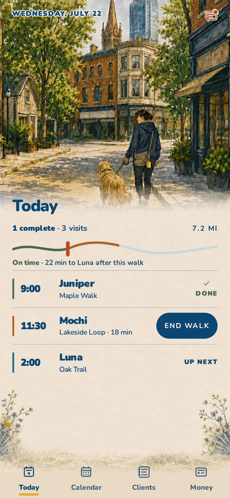
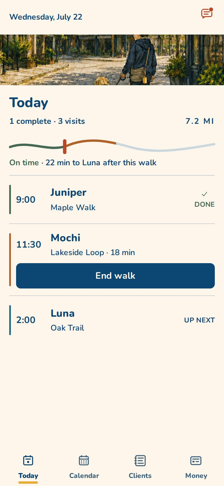

# Compact Today: review against the current application

Status: development-only candidate; not a production redesign or a transfer
of primary maintenance. Based on main `0b8bddf5e3653ffcbfc8ad2b33465f9b5ce770f1`.

## Why this exists

The owner questioned whether the illustrated area earns its screen space.
Earlier image mockups did not use the current application. This comparison
starts with the real Today component and preserves its DOM, data contract,
chronological sequence, accessible links and End walk destination. The compact
wrapper changes presentation only. The normal Dashboard remains unchanged.

The current code is a pre-production application with implemented scheduling,
client records, walk capture, billing and tests, not a blank prototype. Its
production Today screen polls visit data every minute and on return to the
foreground. Row links lead to the client record, and End walk leads to Walk
Mode. The `ScheduleEditor` and Calendar remain the editing workflow.

## Open the comparison

Run the app using `app/README.md`'s local setup, then open:

- `/dev/today`: existing full composition.
- `/dev/today?layout=compact`: compact candidate.
- Append `&visits=0`, `&visits=8` or `&visits=12` to the compact URL for empty
  and longer days; use `?visits=N` on the baseline.

These routes use the same deterministic fixture. They do not fetch real
customer records, and their fixture link destinations are not real accounts.
The original fixture's distance and pace copy are sample inputs, not a new
travel-time calculation. Both routes are excluded from production builds.

## What changes in the candidate

- A dedicated 88px image region instead of registering the schedule over the
  full-height painting. This is explicitly a decorative identity allowance,
  not a claim that a street scene makes the schedule easier to understand.
- Opaque Cream beneath all operational text, with the existing CT-1 colors,
  approved icons, visit states and native links.
- Rem-based type, wrapping pet/property names, and a 44px-minimum full-width
  End walk control within the current row, separate from its client link.
- Natural vertical scrolling and extra bottom clearance for longer days or
  enlarged text. No fixed-ratio field, clipped schedule or shrinking type to fit.
- The existing width and image-srcset contract is retained. Only the DEV
  candidate crops the supplied image with CSS; asset files/hashes are unchanged.
  The narrow crop is provisional and should be replaced by deliberately
  composed header artwork only if the layout earns promotion.

## What the browser measurement actually shows

Same three-visit fixture, 390 x 844 CSS pixels, DPR 2, fonts and images loaded:

| Measurement | Existing | Compact |
| --- | ---: | ---: |
| Today heading starts at | 335px | 164px |
| End walk bottom edge | 574px | 501px |
| Bottom navigation starts at | 788px | 788px |
| Full rows visible above navigation | 3 | 3 |

The existing app already fits this sample day. The compact layout's demonstrated
benefit here is earlier content and more room for readable text and the action;
it does **not** reveal an extra visit in this fixture. The original image's
801px element height includes painted paper behind the UI, so it would be
misleading to call all 801px a decorative hero.

## Findings to resolve separately

1. `Dashboard.tsx` derives “Over time” from `is_overage`, a billing field, and
   otherwise calls an active walk “On time”. That is not evidence of schedule
   punctuality. A follow-up should separate walk activity from billing and
   lateness before designing around an attention signal.
2. Production visit rows currently receive a start time with AM/PM stripped,
   a property label and elapsed time for active visits. They do not receive
   the full window or scheduled service duration described by spec 05.
3. There is no travel estimate in the Today component contract. The eight-minute
   conflict used in the earlier image mockups must not become a real warning
   without an authoritative source and explicit assumptions.
4. The DEV preview's inbox and visit IDs are fixtures. Real client/vault access
   must be exercised through the production workflow during any later promotion.

These are review findings, not fixes bundled into a layout experiment. No
billing, API, database, credential, deployment or scheduling behavior changes.

## Evaluation boundary

Automated checks establish layout bounds, contrast, scrolling and preserved
link destinations, not task performance or outdoor readability. Before choosing
a production layout, compare next-visit recognition, finding the active walk,
opening client instructions and reaching the last visit on a long day. Use the
same data, counterbalance which layout people see first, and record correctness
as well as time. Repeat outdoors with working pet-care professionals.

The compact option is a baseline to test, not a claimed usability winner.

## Validation and self-review

Local validation on 2026-09-04 used the committed npm lockfile and Deno 2.9.1.

| Check | Result |
| --- | --- |
| Frontend typecheck and lint | Pass |
| Frontend unit tests | 725 pass |
| Browser tests | 52 pass, including nine new compact cases |
| Compact coverage | 320–1440px widths, 200% text, long/empty days, link destinations, normal/increased contrast |
| Production build and asset integrity | Pass; 28 assets verified; compact component/CSS markers absent from production JS/CSS |
| Repository invariant checks | Pass |
| Edge typecheck and tests | Blocked: npm registry refused Deno's dependency connection; neither check completed |
| Database tests and generated types | Skipped: local database prerequisites unavailable |

`scripts/validate.sh` reported 12 passed, two skipped and two failed. The two
failures were dependency-download errors in the edge gates; this is **not** a
fully green validation run. CI must finish the backend and database checks
before any merge.

A negative control temporarily removed the compact stylesheet. The 320px test
failed on the intended art-height assertion (658px versus a 96px ceiling).
The fixed file was restored byte-for-byte and the same test passed again.

This is self-review, not an independent design or engineering review. The
candidate's narrow crop cuts the figure and dog and is not final artwork.
The existing three-row sample already fits the phone. Successful geometry
and contrast checks do not establish a usability improvement, and the
development fixture does not validate authenticated client or walk operations.
